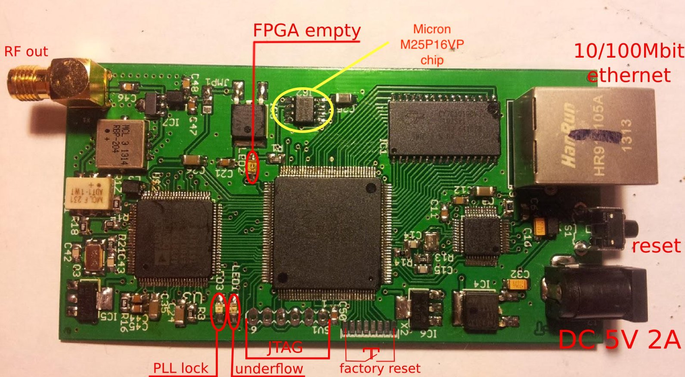

# EasyDABv2-Flash
For raspberryPI 2 & 3 - Flash Micron M25P16VP chip 

Download FLASHROM software (more infos here: https://www.flashrom.org/RaspberryPi):
* sudo apt-get install flashrom 
 
 Follow this pins connections beetween EasyDABv2 and RPI:
 
 -  
 
 - 
 
 Download and exact last firmware: (depend of your firmware, here the last up-to-date SFN firmware.)
 - https://tipok.org.ua/downloads/hardware/DAB-TX/Spartan6-FPGA/EasyDABv2/SFN/easydabv2.6144-20.06.2018_fullflash.tar.gz
 
 
 Run the spi-flash programm and keep "reset" button pressed during all flashing process.
 
 * sudo flashrom -p linux_spi:dev=/dev/spidev0.0,spispeed=1000 -w /home/pi/your_directory/easydabv2.6144-20.06.2018_fullflash/easydabv2.6144-20.06.2018.bin
 
  
 
 EasyDABv2 is now reset at 192.168.2.4 IP, admin-admin for user-pass.
 
 
