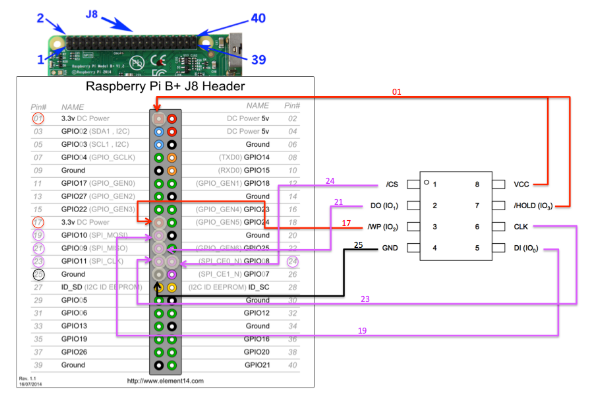
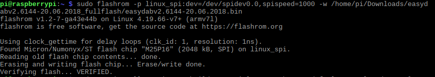

# Easydab-flash

Download FLASHROM software:
 -sudo apt-get install flashrom 
 
 Follow this pins connections beetween EasyDABv2 and RPI:
 
 -  
 
 Download and exact last firmware:
 - https://tipok.org.ua/downloads/hardware/DAB-TX/Spartan6-FPGA/EasyDABv2/SFN/easydabv2.6144-20.06.2018_fullflash.tar.gz
 
 
 Run the spi-flash programm and keep "reset" button pressed
 
 - sudo flashrom -p linux_spi:dev=/dev/spidev0.0,spispeed=1000 -w /home/pi/Downloads/easydabv2.6144-20.06.2018_fullflash/easydabv2.6144-20.06.2018.bin
 
  
 
 EasyDABv2 is now ready to use.
 
 
